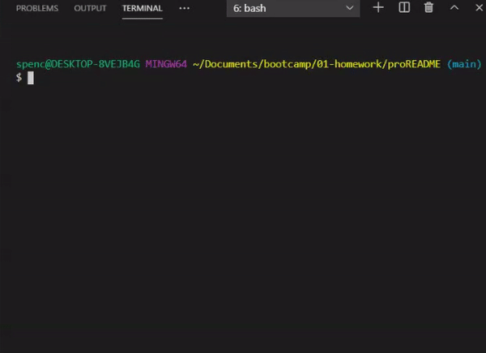

# proREADME


## Description
An application to generate professional README markdown files.

## Table of Contents
* [Links](#links)
* [Animation](#animation) 
* [Instructions](#instructions) 
* [Installation](#installation) 
* [Tests](#tests)
* [Contribute](#contribute) 
* [Technologies](#technologies)  
* [License](#license)
* [Contact](#contact)

## Links
Repository: [https://github.com/spencercreer/proREADME](https://github.com/spencercreer/proREADME)


## Animation
The following animation demonstrates the application functionality:
<br>

## Instructions
Must have node.js installed.
## Installation
To install necessary dependencies, run the following command:

  ```
  npm i
  ```
## Tests
To run tests, run the following command:
 
  ```
  npm test
  ```
    
## Contribute
Please submit a PR if you would like to contribute.

## Technologies
 * JavaScript
 * Node.js
 * npm

## License
This project is licensed under the MIT license.

## Contact
For questions or comments, please contact me.

  Email: <a href="mailto: spencercreer@gmail.com" target="_blank">spencercreer@gmail.com</a>

  GitHub: [spencercreer](https://github.com/spencercreer/)
